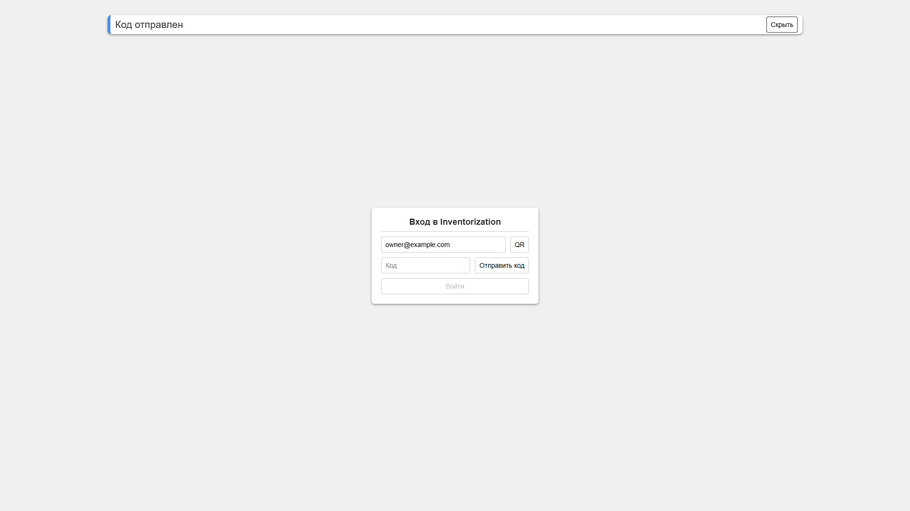
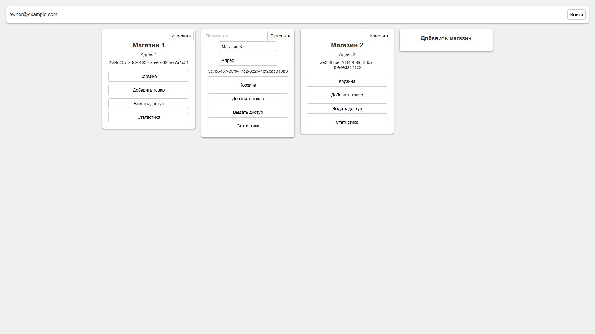
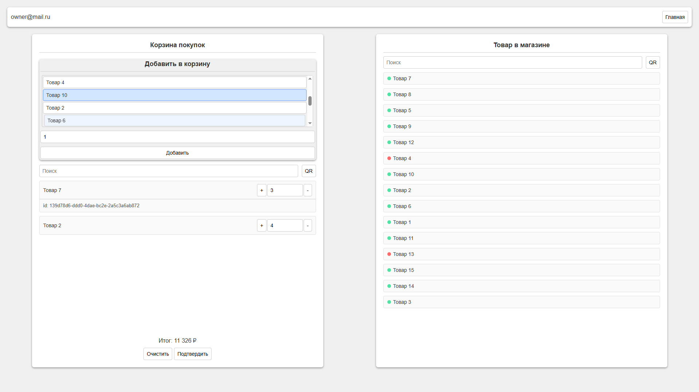
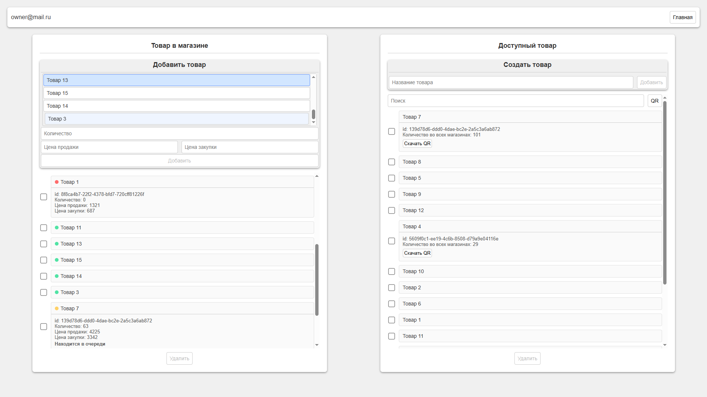
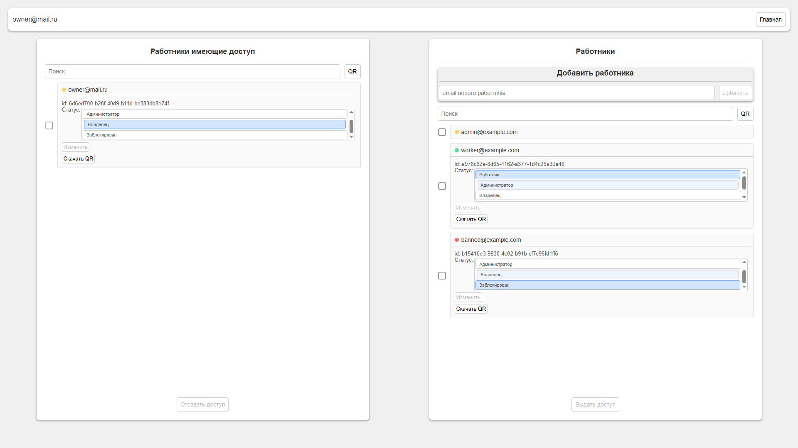
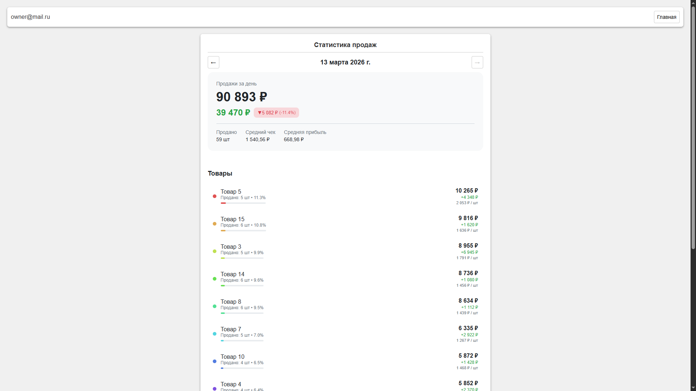
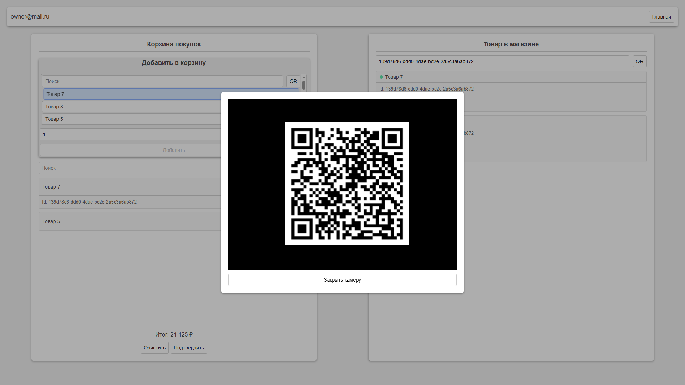

# Внимание.

**Важно:** Проект создавался как демонстрация навыков и включал разработку API и фронтенда на React. Со временем он был заброшен, и сейчас до него дошли руки. Вероятнее всего проект останется MVP и не будет полностью завершён.
**Проект не покрыт текстами.**
_Возможно, буду писать обновление. Смотреть ветку dev._











## TODO: Вещи, которые стоит сделать, чтобы проект смотрелся завершенным.

1. Сделать refactoring code, поработать над названиями переменных и классов.
2. Переделать авторизацию, сделать вход по Cookie.
3. Покрыть всю серверную часть тестами.


# Запускаем проект в демонстрационном режиме.

## Запуска сервера.

### Настраиваем переменные окружения.

1. Проект написан на Python 3.11.7

2. Переходим в папку /backend в новом терминале.
> cd ./backend

3. Ставим все зависимости.
> pip install -r ./requirements.txt

4. Создаём файл .env и заполняем данные.
```
DEBUG=""  # Режим отладки [True|False]
POSTGRESQL_USER=""  # Имя пользователя postgresql
POSTGRESQL_PASSWORD=""  # Пароль пользователя postgresql
POSTGRESQL_HOST=""  # Хост, на котором крутится база данных
POSTGRESQL_PORT=""  # Порт, на котором крутится база данных
POSTGRESQL_DATABASE=""  # Имя базы данных

REDIS_HOST=""  # хост Redis
REDIS_PORT=""  # порт Redis

SMTP_EMAIL=""  # email-адрес, с которого будут отправлять сообщения
SMTP_PASSWORD=""  # пароль от email
SMTP_PORT="" # порт SMTP-сервера
```

5. Применяем изменения базы данных.
> alembic upgrade head

6. Убедитесь, что Redis запущен

### Создание ключей для JWT.

1. Переходим в директорию jwt.
> cd ./auth/jwt

2. Создаем приватный ключ.
> openssl genrsa -out private.pem 2048

3. Создаем публичный ключ из приватного.
> openssl rsa -in private.pem -outform PEM -pubout -out public.pem


### Запуск сервера.

1. Запускаем uvicorn.
> uvicorn main:app

2 . Переходим по ссылке и можно протестировать API через интерфейс /docs.
[Docs](http://127.0.0.1:8000/docs).


**Важно:** В документации FastAPI (по адресу `/docs`) параметр для входа называется `username`, но на самом деле это поле ожидает ваш `email`. Пожалуйста, используйте его при выполнении запроса.
Для получения одноразового кода воспользуетесь /send-otp.


## Запуск фронтенда.

1. Переходим в папку /frontend в новом терминале.
> cd ./frontend

2. Ставим все зависимости.
> npm install

3. Собираем фронтенд-проект.
> npm run build

4. Запускаем локальный preview фронтенда.
> npm run preview

[WebSite](http://localhost:4173/).


